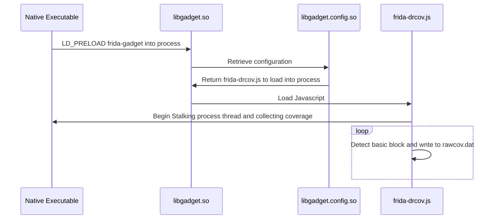

In [part one](https://datalocaltmp.github.io/visualizing-android-code-coverage-pt-1.html) of this series  I described how to vizualize Android application code using Dragon Dance + Frida + Lighthouse + Ghidra. Though there is one big hang-up, what if you **don't have root** or **want to examine a non-app process**. 

Fear not! For those of us who want to brave the world of non-app processes or are condemned to the lowly shell user, there is another solution explained within.

TL;DR: New tool [here](https://github.com/datalocaltmp/frida-cov) to generate code coverage for Android executables on non-rooted devices.


This write-up will show an example of writing a native harness for the Meta Quest 2's native library `libosutils.so`, it generally crashing**, and how I went about generating debugging coverage using the Frida Gadget shared library rather than Frida Server (which was required as the Quest 2 was not rooted).

## Quest 2 Native Library Example

For those unaware, the Quest 2 VR headset is developed ontop of Android. What's nice about this is that you can enable developer-mode and use all the wonderful tools you're used to as an Android developer/researcher.

I had done just that and decided to dive into the native libraries in `/system/lib64/`. It didn't take much more than a quick `strings ./* | grep _Z | c++filt -n` to identify `libosutils.so` as a native library worth poking.

I got to work writing a native harness as a toy example that would take an integer representing a pid and output the associated process name, sample code below.

```c
#include <stdlib.h>
#include <stdio.h>
#include <dlfcn.h>
#include <string.h>
 
int main(int argc, char *argv[]) {
    void *handle;
    char* (*getProcessName)(int, bool);
 
    // get a handle to the library that contains 'getProcessName' function
    handle = dlopen("libosutils.so", RTLD_LAZY);
 
    // reference to the dynamically-resolved function 'getProcessName'
    getProcessName = dlsym(handle, "_ZN3OVR2OS7Process14getProcessNameEib");
    
    char* output = getProcessName(atoi(argv[argc-1]),1);

    // cleanup
    dlclose(handle);
}

```

And upon running it, sure enough it crashed in the `getProcessName` function, coverage guided debugging time.


## Coverage Guidance Gadgets

Since I did not have the ability to run frida server as shell user, I got invetive and modified the Lighthouse frida coverage generator to work with the Frida gadget shared library. As per the documentation for Lighthouse's `frida-drcov.py` tool it should "only be used for collecting coverage data on mobile applications" and not appropriate for the native executable we're interested in.

I seperated the Python script from part one into two distinct pieces. The first piece generated raw output from Frida's stalker code tracing engine (more [here](https://frida.re/docs/stalker/)), and the second piece took this raw output and converted it into a Lighthouse compatable log.

### Frida ~~Server~~ Gadget Method

1) Rather than using frida-server, use frida gadget via `LD_PRELOAD=./libgadget.so`
2) Within `libgadget.config.so` reference the lighthouse modifided javascript `frida-drcov.js`
3) `frida-drcov.js` stores raw coverage data in `/data/local/tmp/rawcov.dat`
4) Use modified `frida-drcov.py` to convert raw data to DragonDance coverage map
5) Import converage map into Ghidra!

The code that I produced is available [here](https://github.com/datalocaltmp/frida-cov), as well as `libosutils.so` and a sample coverage file if you'd like to follow along.

The general sequence of creating the raw coverage output is documented in the diagram below.


<!---

-->

## Et voila! 

Using this new method I was able to generate the coverage map of the executed basic blocks within `libosutils.so`. I would be lying to say I completely figured out what was causing the crash (I suspect permissions  ¯\\\_(ツ)_/¯); this was a toy example that was meant for illustrative purposes #CopOut.

If you have any questions feel free to send them my was @datalocaltmp, thanks for reading!


## Notes
\* Passing arguments to an executable which is being injected by frida-server had posed some issues for myself as it did not expect an app process to receive any arguments.

\*\* Note that this crashing is user error and not any fault of Meta's ;)
