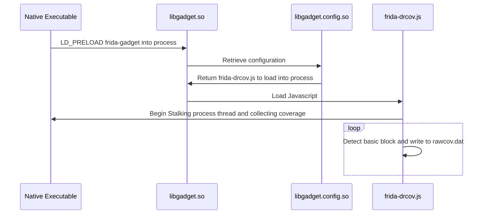

In part one of this series [here](http://example.com) I described how to vizualize Android code using Dragon Dance + Frida + Lighthouse + Ghidra. This really is a solid solution for visualizing application code and will often be enough for 99% of developers and researchers. 

For those of us who want to brave the world of native Android executables, be it for debugging purposes, root-cause-analysis, or general research the standard method will not work as previously described.

## Part 1 tl;dr

## Frida ~~Server~~ Gadget

1) Instead of using frida-server, use frida gadget via `LD_PRELOAD=./libgadget.so`

2) Within `libgadget.config.so` reference the lighthouse modifided javascript `frida-drcov.js`

3) `frida-drcov.js` stores raw coverage data in `/data/local/tmp/rawcov.dat`

4) Use modified `frida-drcov.py` to convert raw data to DragonDance coverage map

5) Import converage map into Ghidra!
