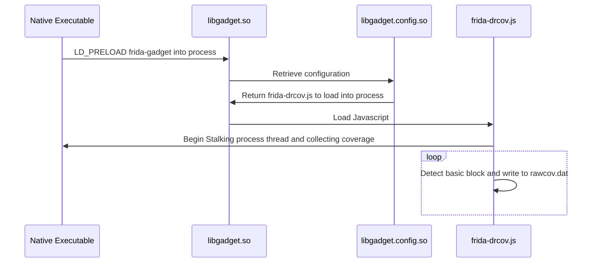

In part one of this series [here](https://datalocaltmp.github.io/visualizing-android-code-coverage-pt-1.html) I described how to vizualize Android application code using Dragon Dance + Frida + Lighthouse + Ghidra. 

This really is a solid solution for visualizing native application code and will often be enough for 99% of developers and researchers. Though there is one big hang-up, what if you **don't have root** or **want to examine a non-app process**. Of course frida-server won't run on a non-rooted device, and even if it is running on a rooted device it can still encounter issues when hooking non-app processes such as executables*.

Fear not! For those of us who want to brave the world of Android non-app processes and un-rooted devices, there is another solution known as Frida's Gadget shared library (read more [here](https://frida.re/docs/gadget/)).


This write-up will show an example of writing a native harness for the Meta Quest 2's native library `libosutils.so`, it generally crashing**, and how I went about generating debugging coverage using the Frida Gadget shared library rather than Frida Server (which was required as the Quest 2 was not rooted).

## Quest 2 Native Library Example

For those unaware, the Quest 2 VR headset is developed ontop of Android. What's nice about this is that you can enabling developer-mode and use all the wonderful tools you're used to as an Android developer/researcher.

I had done just that and decided to dive into the native libraries in `/system/lib64/`. It didn't take much more than a quick `strings ./* | grep _Z | c++filt -n` to identify `libosutils.so` as a native library worth poking.

I got to work writing a native harness that would take an integer representing a pid and output the associated process name, sample code below.

```c
#include <stdlib.h>
#include <stdio.h>
#include <dlfcn.h>
#include <string.h>
 
int main(int argc, char *argv[]) {
    void *handle;
    char* (*getProcessName)(int, bool);
 
    // get a handle to the library that contains 'getProcessName' function
    handle = dlopen("libosutils.so", RTLD_LAZY);
 
    // reference to the dynamically-resolved function 'getProcessName'
    getProcessName = dlsym(handle, "_ZN3OVR2OS7Process14getProcessNameEib");
    
    char* output = getProcessName(atoi(argv[argc-1]),1);

    // cleanup
    dlclose(handle);
}

```

And upon running it, sure enough it crashed in the `getProcessName` function, coverage guided debugging time.

## Coverage Gadgets


<!---

-->


## Frida ~~Server~~ Gadget

1) Instead of using frida-server, use frida gadget via `LD_PRELOAD=./libgadget.so`

2) Within `libgadget.config.so` reference the lighthouse modifided javascript `frida-drcov.js`

3) `frida-drcov.js` stores raw coverage data in `/data/local/tmp/rawcov.dat`

4) Use modified `frida-drcov.py` to convert raw data to DragonDance coverage map

5) Import converage map into Ghidra!


## Notes
\* Passing arguments to an executable which is being injected by frida-server had posed some issues for myself as it did not expect an app process to receive any arguments.

\*\* Note that this crashing is user error and not any fault of Meta's ;)
