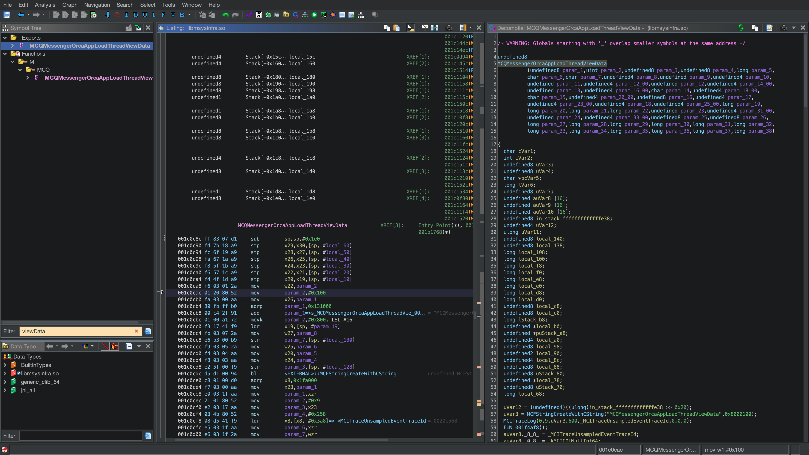
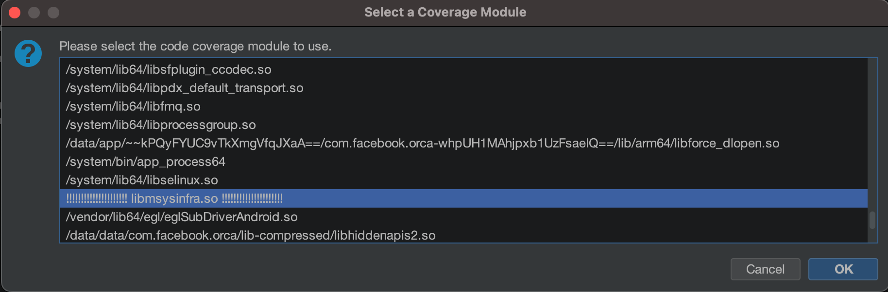
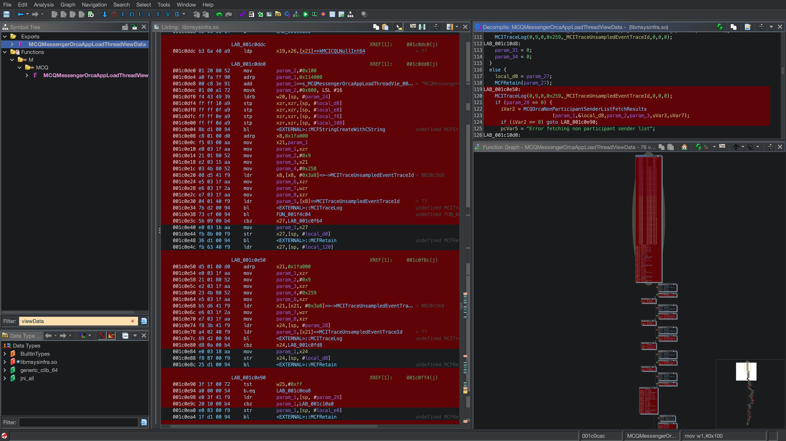
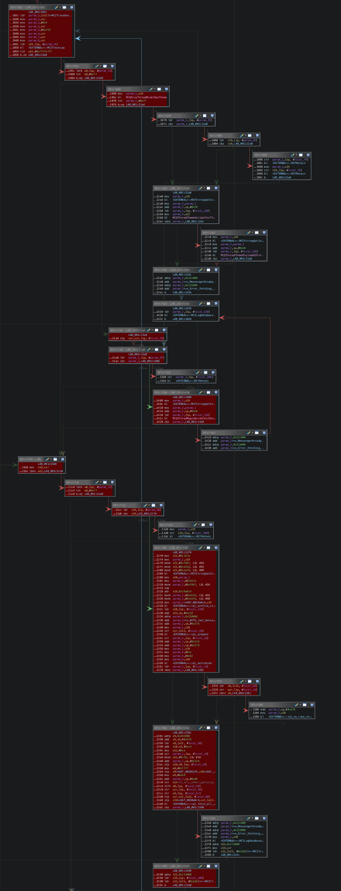
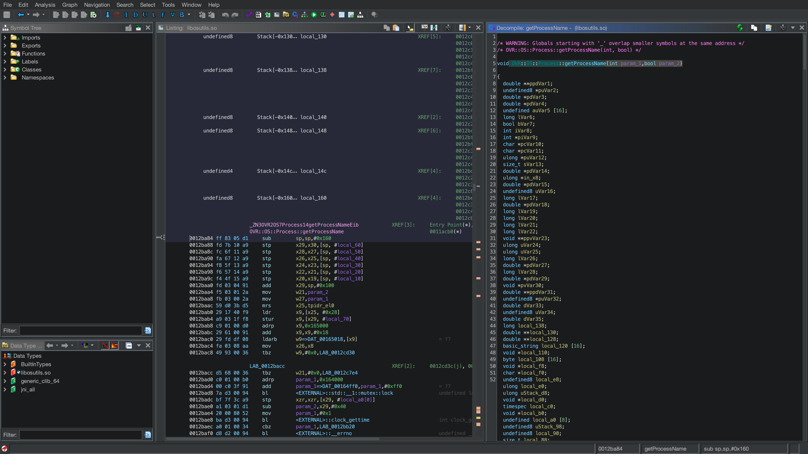
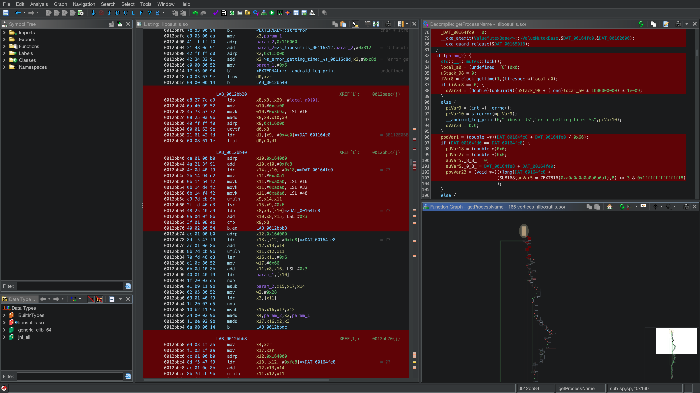

<!-- 
Notes: 
  * Hi everyone! 

  * Name is datalocaltmp or datalocal"temp".

  * In today's talk titled "A Ghidra Visualization is worth a thousand GDB Breakpoints" I'll be describing how I've enhanced my reverse engineering and debugging tasks through code coverage visualizations.

  * Thanks to BSides Montreal for the space and all the hard work they've done gathering everyone!

-->

## A Ghidra visualisation is worth a thousand GDB breakpoints.

**@datalocaltmp**

---
<!-- footer: 'datalocaltmp | https://datalocaltmp.github.io/ | 2023' -->

<!-- 
Notes: 
  * Independent security researcher focused on mobile
  
  * Previously dedicated to researching privacy within mobile apps and featured in TechCrunch as "theappanalyst"
  
  * Some notable bounty programs I've worked with include Bird Scooters, Biden Campaign App, Ring Cameras, Match.com.
  
  * Nowadays I focus on mobile platform security and in particular reverse engineering the native layer
  
  * Virtual Reality Enthusiast
-->

# $whoami
## Security Researcher
* Previously focused on privacy issues within mobile applications.
  * Featured in TechCrunch for shining a light on apps screenshot'ing credit card information & passwords.

* Claimed bounties with: Bird Scooters, the Biden Campaign App, Ring Cameras, Match.com, etc.

* Nowadays focus on mobile platform security with a recent eye towards native reverse engineering.

* A virtual reality enthusiast!

---

<!-- 
Notes: 
  
  * 

-->

# Resources

- [Debugging Android with LLDB and Voltron](https://datalocaltmp.github.io/debugging-android-with-lldb.html)

- [Visualizing Android Code Coverage Pt.1](https://datalocaltmp.github.io/visualizing-android-code-coverage-pt-1.html)

- [Visualizing Android Code Coverage Pt.2](https://datalocaltmp.github.io/visualizing-android-code-coverage-pt-2.html)

- [NCC Groups Cartographer Tool](https://github.com/nccgroup/Cartographer)

- [Lighthouse Coverage Generation Tool](https://github.com/gaasedelen/lighthouse/tree/master/coverage/frida)

- [Extended Coverage Generation Tool & Samples](https://github.com/datalocaltmp/frida-cov)

---

<!-- 
Notes: 
  
  * My goal today is to introduce you to the world of code coverage visualizations all within 25 minutes. I'll try and do this by first....

  * Describing a scenario where you would have to do traditional debugging with gdb and a decompiler, highlight some of the shortcomings.

  * Next I'll show you how to generate these visualizations, specifically for a common Android App (in this instance Facebook Messenger).

  * Then I'll finish with addressing the first scenario by using code coverage visualizations and hopefully illustrate their benefit.

-->

# Content

* Classic debugging/reverse engineering
    * Tracking execution with GDB

* Generating Visualizations - Android Apps
    * Showcase standard tooling
    * Example: Facebook Messenger Native Library

* Generating Visualizations - Executables
    * Showcasing my frida-cov tool available on [github](https://github.com/datalocaltmp/frida-cov)
    * Example: Meta Quest 2 Binaries

---

<!-- 
Notes: 

    * To start I'd like to talk about when you would conduct traditional debugging or reverse engineering.

    * Often debugging and reversing happens when you have a binary and you want to understand what it's doing but don't have the source code to guide you.

        * I.e Corporate mobile apps, imported  libraries, malware.

    * This process generally consists of static and dynamic components
        
        * Decompiling 
        * Debugging

-->

# Classic Reverse Engineering & Debugging

* Often we have a binary that we want to understand but won't have the code
    * A mobile application your company uses on their corporate devices,
    * libraries your companies software interfaces with,
    * or run-of-the-mill malware.

* Generally consists of both dynamic and static analysis
    * Static - Decompiling w/ IDA, Ghidra, Binary Ninja, radare2 etc.
    * Dynamic - Debugging w/ GDB, LLDB, or even Frida

* Problem: Understanding a large amount of complexity can be time-consuming and wrought with red-herrings.
    * I.e Messengers `MCQMessengerOrcaAppLoadThreadViewData` function

---

<!-- 
Notes: 

    * Because I want to have an example that we can actually demo the coverage generation against later, I've written a bit of a toy scenario for the Meta Quest 2.

    * Lets say you're a game dev who wants to interface with a utilities library on the Quest 2

    * Your game calls a function that returns a processes name given a pid, and you're hoping to use this to catch cheaters

    * You go ahead and test out your game and...

-->

# Example: Quest 2 Game Development

* You're a VR game developer and you've written a simple game that depends on a utilities library - `libosutils.so`
    * Note: You don't have the source code for this library.

* Your game calls `getProcessName` within `libosutils.so` to return a process name based on the a pid
    * Perhaps this is part of some anti-cheat engine

* Go ahead and test out your game and ....

---

<!-- 
Notes: 

    * Your anti-cheat engine crashes the game and it's all because you wanted to get the process name using that utilities library.

    * A couple of notes here from this crash dump
        * 1. We see that we're running this from the command line, that's a toy program I've written that we'll use later to generate coverage.
        
        * 2. We can see where the program crashed and we can get underway setting our breakpoints.
    
    * And this is when we'd start the debugging process.

-->

# Example: `libosutils.so` Crash

---

<!-- 
Notes: 

    * So finally we can say the general process will look like

    1. you decompile the binary and examine the getProcessName function.
    
    2. run your game with the debugger attached and set a breakpoint on the crashing function.

    3. set a breakpoint on the crashing function.

    4. Iterate until you understand the bug.

-->

# Example:  Debugging `libosutils.so`

1. Decompile `libosutils.so` with your tool of choice and examine `getProcessName`
    - Static portion of our analysis 

2. Run your game with GDB attached and set a breakpoint on `getProcessName`
    - Dynamic portion of our analysis

3. Setting breakpoints within the crashing function
    - In this instance it would be good to set a breakpoint just prior to the crashing instruction at `0x2c9b0`
    - Taking detailed notes on the execution flow prior to the crash to understand the program state prior to the crash

4. Iterate, iterate, iterate
---

<!-- 
Notes: 

    * 

-->

# Example: Debugging `libosutils.so`

<video controls>
  <source src="./media/lldb-demo.webm" type="video/webm">
  Your browser does not support the video tag.
</video> 

---

<!-- 
Notes: 

    * This is going to take a lot of iterations to get to the root of the bug

    * During the decompiliation you might be tempted down a path that has no relevance to the bug at hand

    * Finally, note taking is prone to human-error; you might write-down the wrong offset and investigate something useless.

    * so in generally it'd be really nice if we could quickly collect the ground truth regarding what's executed.

-->

# Debugging Takeaways

* Process requires a lot of iterations to comprehend the root-cause of the bug

* There is potential to reverse engineer functionality that has no relevance
    * Just because it's decompiled doesn't mean you need to look at it

* Note taking is prone to human-error

* If only there were a way to quickly collect the ground truth of program execution ...

---

<!-- 
Notes: 

    * And we can because of all these fine tools
    
    * Due to time, the cliff notes are that:
    
    * Lighthouse generates the coverage information by using frida to inspect each assembly instruction executed.

    * Cartographer loads the coverage information into Ghidra for visualization

    * Note that I had to patch Cartographer to work with the older coverage output produced by lighthouse and that patched cartographer is available on my git.

-->

# And we can!

- Thanks to,
    
    - Frida - Ole Andre (Maintainer),
        - Provides assembly instruction insight
    
    - Ghidra,
        - Decompilation & function graphing
    
    - Cartographer,
        - Ghidra coverage visualization
        - Cartographer patch [here](https://github.com/datalocaltmp/frida-cov/blob/main/cartographer-release/ghidra_10.3.1_PUBLIC_20230816_Cartographer.zip)
    
    - and Lighthouse
        - Code coverage collection tool

---

<!-- 
Notes: 

    * So lets hop into it and generate some coverage

    * So I've picked facebook messenger since it's somewhat like a lorum ipsum of applications

    * I've picked an arbitrary function that runs when we open a message

    * It's worth noting that the library we'll look at is one of hundreds of dependencies in Messenger

    * and this example really could easily extend to something like mobile game development.

-->

# Generating Visualizations - Facebook Messenger

* Let's investigate Facebook Messenger's `MCQMessengerOrcaAppLoadThreadViewData` function within `libmsysinfra.so`
    * Arbitrarily picked; runs when we open a message.

* `libmsysinfra.so` is one of hundreds of libraries imported by Facebook Messenger
    * Represents a real-world example of generating coverage

* This example could easily extend to generating coverage to debug mobile games

---
<!-- 
Notes: 

    * I'll have a short video after this but the general process is;

    * You run frida-server on the device executing the program
        * Note that it can help to first determine when the function is called using frida-trace

    * Navigate within the Lighthouse tool and run their coverage generator for the Application
        * You may crash the process if there are too many threads
        * Note that this process only works for Android apps (hint that it wouldn't work for the previous Quest example)

    * Finally, load the output coverage file into the Cartographer Ghidra extension
-->

# Generating Visualizations - Process Overview

1. Android device needs to be running `frida-server`
    - Use `frida-trace -U Messenger -i 'libmsysinfra.so!*'` to determine calling conditions

2. Navigate within Lighthouse and run `python3 frida-drcov.py -D emulator-5554 Messenger`
    - If there are too many threads you may need to narrow it down with the `-t` thread flag
    - Note that this only works for Android applications, not executables (*hint hint*)

3. Load the resulting coverage output into Ghidra via the Cartographer extension

---

<!-- 
Notes: 

    * So this is our first attempt at following the process that I outlined above.

-->

# Generating Coverage: Facebook Messenger

<video controls>
  <source src="./media/crash.webm" type="video/webm">
  Your browser does not support the video tag.
</video> 

---

<!-- 
Notes: 

    * This time we'll do the same thing but narrow our focus to the thread which is executing the function we're interested in.

-->

# Generating Coverage: Facebook Messenger

<video controls>
  <source src="./media/good.webm" type="video/webm">
  Your browser does not support the video tag.
</video> 

---

<!-- 
Notes: 

    * So now what does it look like to load that coverage data into Ghidra

-->

# Importing into Ghidra

---

<!-- 
Notes: 

    * Here we are at the function we've just generated coverage for

-->

---
<!-- 
Notes: 

    * We load the coverage data and select the module we're interested

    * I've modified the coverage data to subtly highlight the specific module we're loading

-->

---
<!-- 
Notes: 

    * O

-->

---

<!-- 
Notes: 

    * And now we can answer the question I posed earlier; what blocks within the blue and red highlighted area are executed.

    * Compared to the classic process of using GDB breakpoints we can immediately know the ground truth for program execution.

-->

---

<!-- 
Notes: 

    * So what about if we want to generate coverage for process that aren't apps or aren't running on a rooted device (a.k.a we can't run frida-server)

-->

# Generating Coverage: Executables

* What if we want to generate coverage for a process that isn't an app?
* What if we want to generate coverage for a process on a non-rooted device?
* Unfortunately that was not supported ...
    * Until now!
* All demo files, patched Cartographer version, and tooling is available at [github.com/datalocaltmp/frida-cov](https://github.com/datalocaltmp/frida-cov)

---

# Add another library to the mix

1) Instead of using frida-server, use frida gadget via `LD_PRELOAD=./libgadget.so`

2) Within `libgadget.config.so` reference the lighthouse modifided javascript `frida-drcov.js`

3) `frida-drcov.js` stores raw coverage data in `/data/local/tmp/rawcov.dat`

4) Use modified `frida-drcov.py` to convert raw data to a coverage map

5) Load the coverage map into Ghidra!

---

# Obligatory Diagram

---

# Quest 2 Game Development - Round 2

* Lets see if we can generate the coverage map for `getProcessName` within `libosutils.so`

* We'll attempt a live demo here...

---

# Live Demo!

---

# Or Not!

<video controls>
  <source src="./media/questDemo.webm" type="video/webm">
  Your browser does not support the video tag.
</video> 

---

---

---

# In Summary

* Generating visualizations to guide your reverse engineering/debugging tasks can really speed things up

* There are many features within Cartographer that I haven't mentioned
    * Diffing multiple coverage files to determine difference between inputs,
    * Function execution frequency,
    * Coverage %

* Good luck!

---

# Thanks!

---

# Questions?

