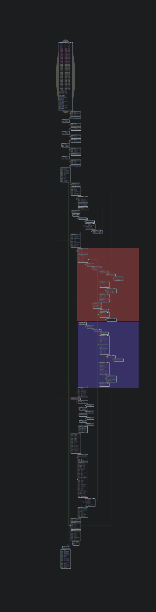

<!-- 
Notes: 
  * Hi everyone! 

  * Name is datalocaltmp or datalocal"temp".

  * In today's talk titled "A Ghidra Visualization is worth a thousand GDB Breakpoints" I'll be describing how I've gone about generating visualizations of executed code in my binaries to assist in my reverse engineering and debugging tasks.

  * Thanks to BSides Montreal for the space and all the hard work they've done gathering everyone!

  * Also after this presentation I'll be tweeting out a link to my slide-deck so if you're interested in any of the links here; you can grab them there.
-->

## A Ghidra visualisation is worth a thousand GDB breakpoints.

**@datalocaltmp**

---
<!-- footer: 'datalocaltmp | https://datalocaltmp.github.io/ | 2023' -->

<!-- 
Notes: 
  * Independent security researcher focused on mobile
  
  * Previously dedicated to researching privacy within mobile apps and featured in TechCrunch as "theappanalyst"
  
  * Some notable bounty programs I've worked with include Bird Scooters, Biden Campaign App, Ring Cameras, Match.com.
  
  * Nowadays I focus on mobile platform security and in particular reverse engineering the native layer
  
  * Virtual Reality Enthusiast
-->

# $whoami
## Security Researcher
* Previously focused on privacy issues within mobile applications.
  * Featured in TechCrunch for shining a light on apps screenshot'ing credit card information & passwords.

* Claimed bounties with: Bird Scooters, the Biden Campaign App, Ring Cameras, Match.com, etc.

* Nowadays focus on mobile platform security with a recent eye towards native reverse engineering.

* A virtual reality enthusiast!

---

<!-- 
Notes: 
  
  * I'll describe a scenario where 

  * We'll go through the current options for visualization generation within Apps

  * We'll then follow up with an extended method for generation visualziations when you're not looking specifically at Applications or do not have root.

-->

# Content

* Traditional debugging/reverse engineering
    * Tracking execution with GDB

* Why generate visualizations
    * A picture is worth ...

* Generating Visualizations Pt.1
    * Standard tooling for generating visualizations
    * Example: Facebook Messenger Native Library

* Generating Visualizations Pt.2
    * What if you're not reversing an app or you don't have root?
    * Example: Meta Quest 2 Binaries
    * Showcasing my frida-cov tool available on [github](https://github.com/datalocaltmp/frida-cov)

---

<!-- 
Notes: 

    * Often we have a problem

-->

# Traditional Debugging/Reverse Engineering

* Often we have a binary that we want to understand
    * A mobile application your company deploys to Google Play Store,
    * native libraries you're interfacing with,
    * malware on your grandmothers PC.

* Generally an analysis has both dynamic and static components
    * Decompilers like IDA, Ghidra, Binary Ninja, radare2 etc.
    * Debuggers like GDB, LLDB, or even Frida 

* Problem: Understanding large amounts of complexity is time-consuming and wrought with pitfalls and red-herrings.

---

<!-- 
Notes: 

    * Often we have a problem

-->

# Example: Meta Quest 2 Binaries

* Scenario:
    * You're a Quest 2 Hacker and you've written a simple mod that depends on an utilities library named `libosutils.so`
    * Your mod calls the function `getProcessName` within `libosutils.so` to return a process name based on it's pid
    * Go ahead and test out your mod and ....

---

<!-- 
Notes: 

    * Often we have a problem

-->

# Example: Crash in `libosutils.so` 

---

<!-- 
Notes: 

    * Often we have a problem

-->

# Example: `libosutils.so` Traditional Debugging

* Traditional Debugging process would look something like:
    * Reviewing the function in a decompiler
    * Attaching your debugger of choice 
    * Setting breakpoints on the crashing function
        * In this instance it would be good to set a breakpoint just prior to the crashing instruction at `0x2c9b0`
    * Taking detailed notes on the execution flow prior to the crash to understand the program state prior to the crash
---

<!-- 
Notes: 

    * Often we have a problem

-->

# Example: `libosutils.so` Traditional Debugging

<video controls>
  <source src="./media/lldb-demo.webm" type="video/webm">
  Your browser does not support the video tag.
</video> 

---

<!-- 
Notes: 

    * Often we have a problem

-->

# Example: `libosutils.so` Take-aways

* Process requires a lot of interations to comprehend
* Prone to human-error
* If only we could accelerate 

---

<!-- 
Notes: 

    * Often we have a problem

-->

# Thanks too...

* Frida
    * Ole Andre (Maintainer)
* Ghidra
* Cartographer
* Lighthouse

---

<!-- 
Notes: 

    * O

-->

# Ghidra + Cartographer + Frida

* General Usage

---

<!-- 
Notes: 

    * O

-->

# Generating Coverage: Facebook Messenger

<video controls>
  <source src="./media/crash.webm" type="video/webm">
  Your browser does not support the video tag.
</video> 

---

<!-- 
Notes: 

    * O

-->

# Generating Coverage: Facebook Messenger

<video controls>
  <source src="./media/good.webm" type="video/webm">
  Your browser does not support the video tag.
</video> 

---

<!-- 
Notes: 

    * O

-->

# Importing into Ghidra

Demo Time

---

<!-- 
Notes: 

    * O

-->

# Generating Coverage: Non-App Processes

* What if we want to generate coverage for a process that isn't an app?
* What if we want to generate coverage for a process on a non-rooted device?
* Unfortunately that was not supported ...
    * Until now!
* All demo files, patched Cartographer version, and tooling is available at [github.com/datalocaltmp/frida-cov](https://github.com/datalocaltmp/frida-cov)

---

# Add another library to the mix

1) Instead of using frida-server, use frida gadget via `LD_PRELOAD=./libgadget.so`

2) Within `libgadget.config.so` reference the lighthouse modifided javascript `frida-drcov.js`

3) `frida-drcov.js` stores raw coverage data in `/data/local/tmp/rawcov.dat`

4) Use modified `frida-drcov.py` to convert raw data to DragonDance coverage map

5) Import converage map into Ghidra!

---

# Obligatory Diagram

---

# Live Demo!

---

# Questions?

---

# Thanks!
