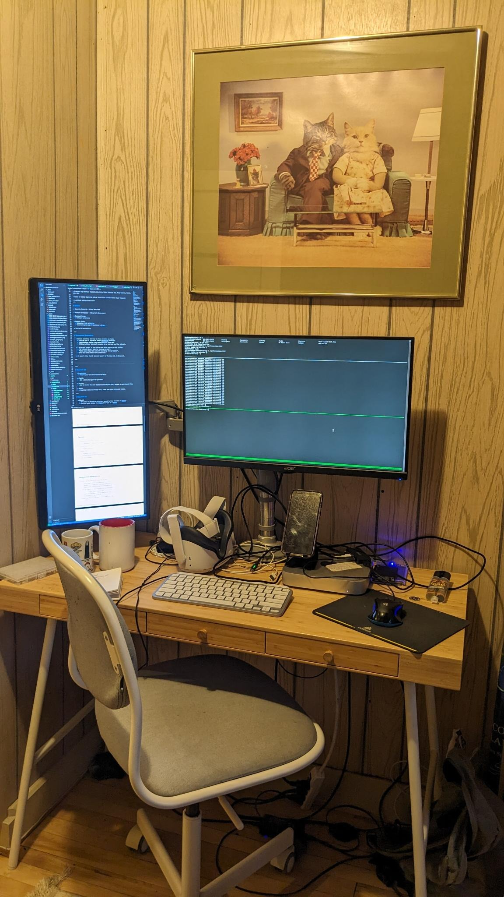
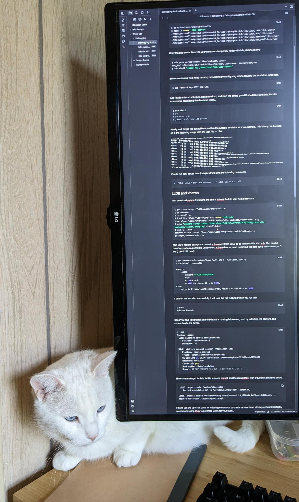
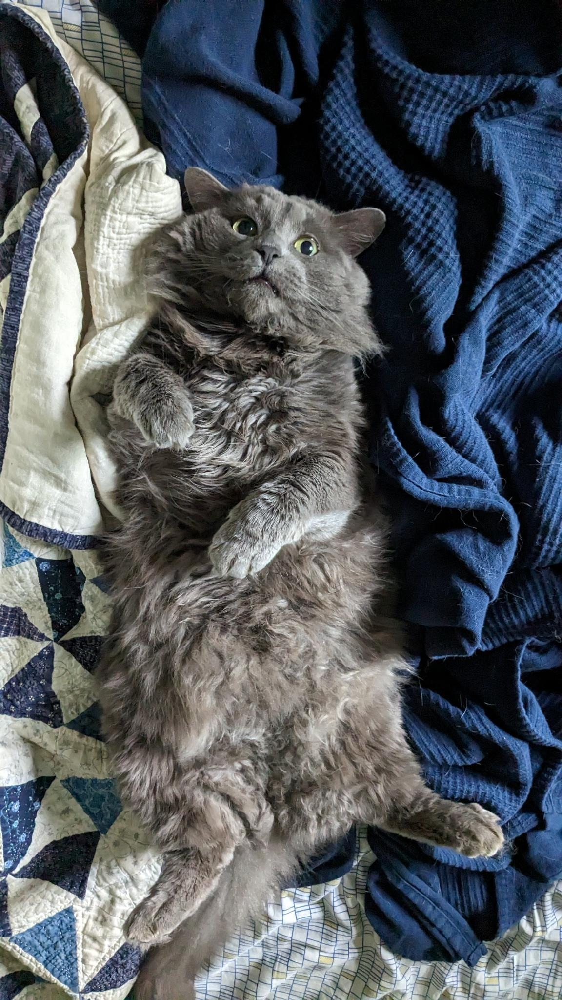
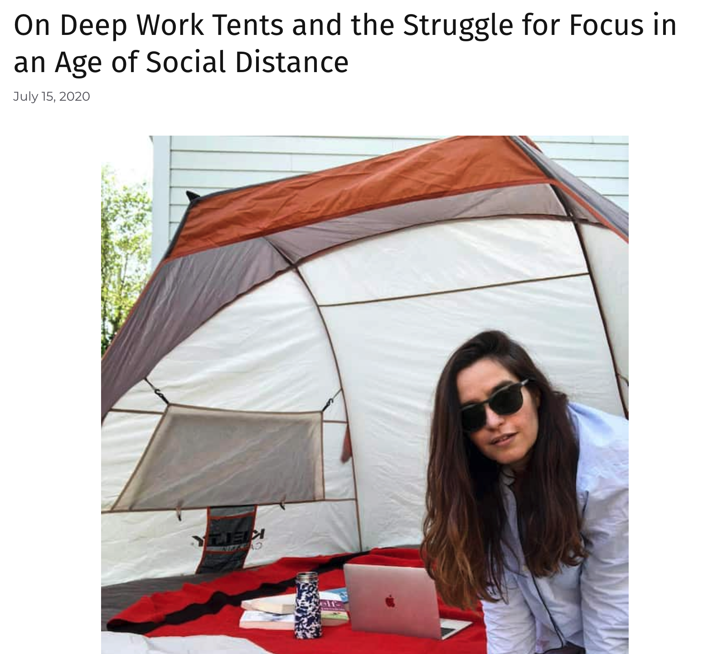
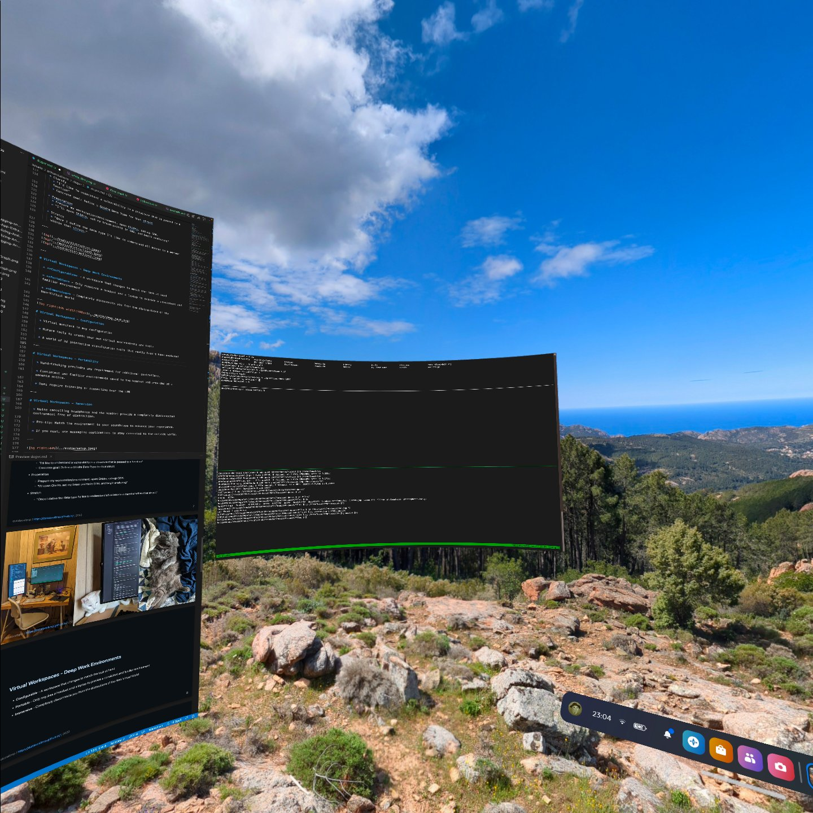
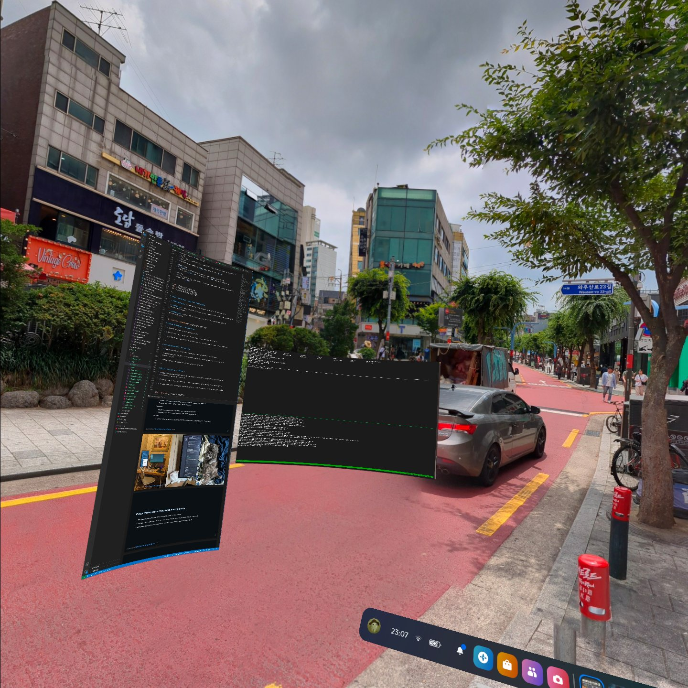
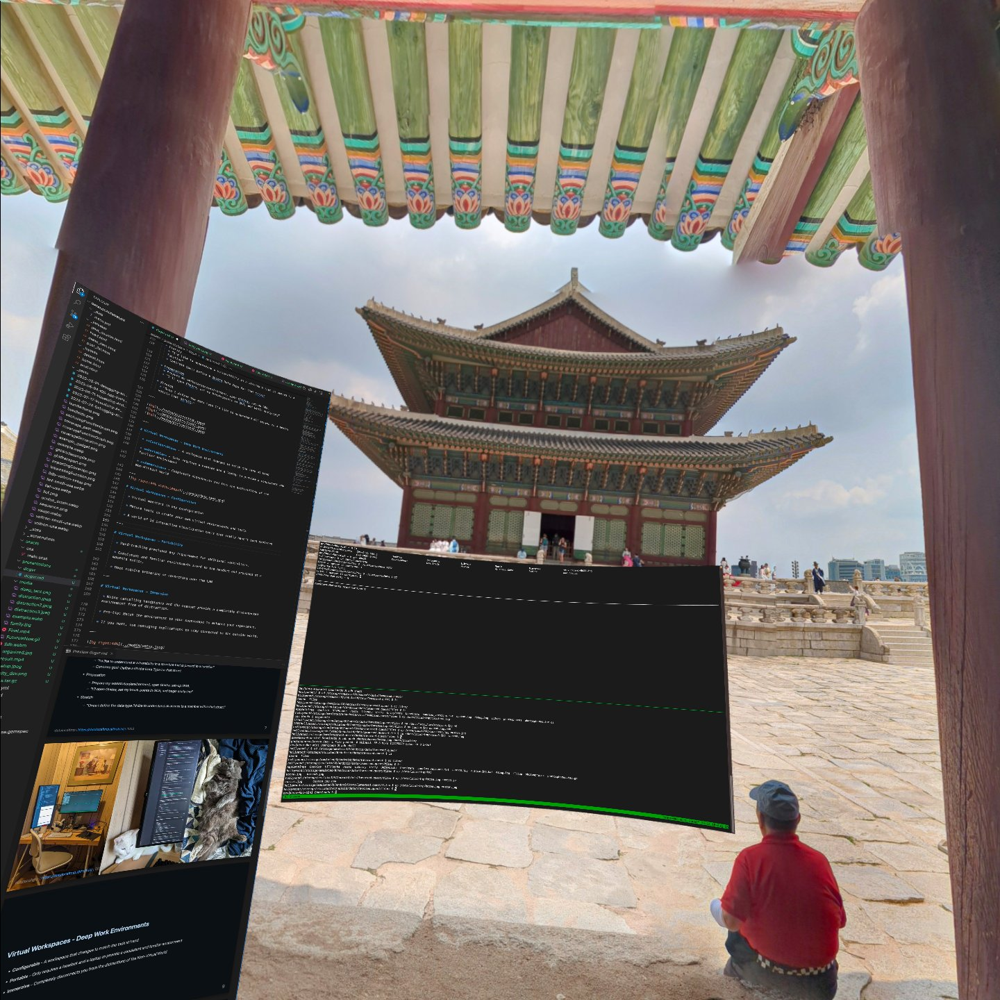
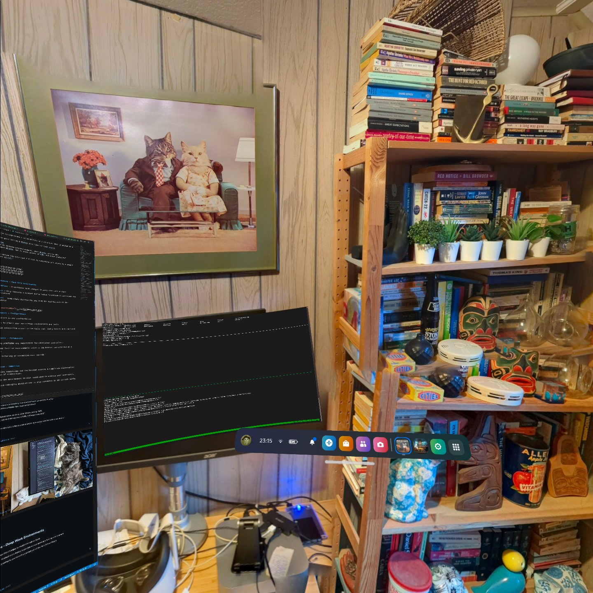
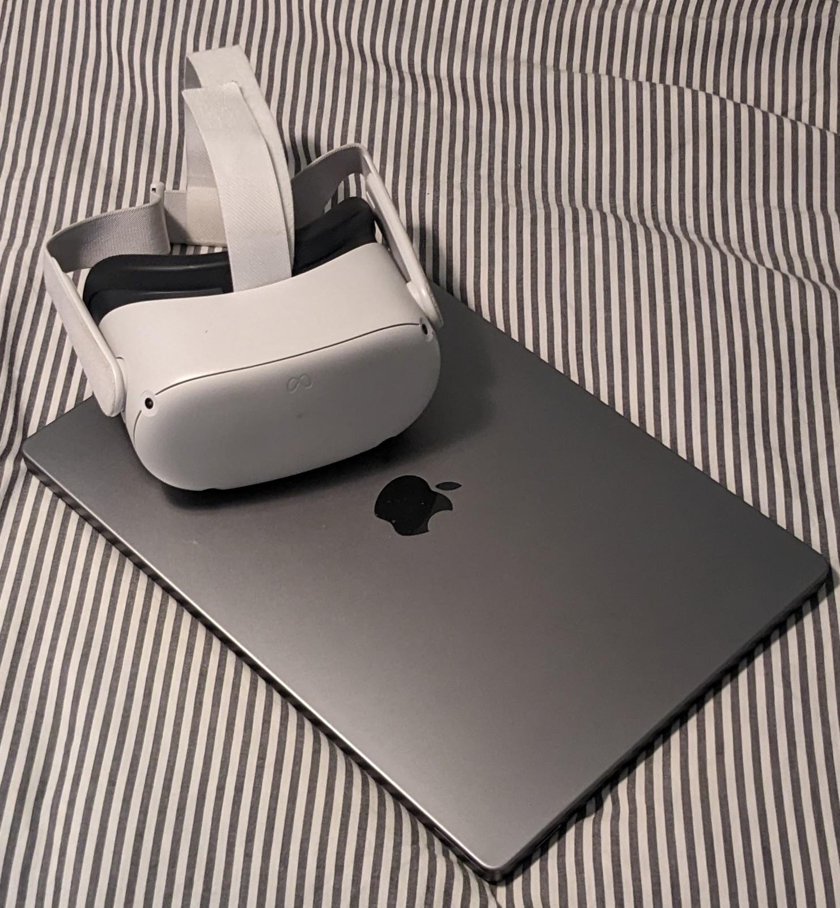
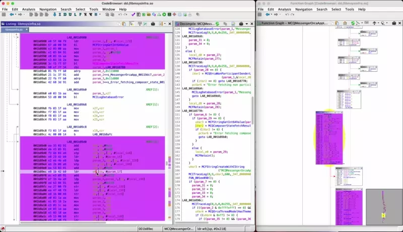

# Security Research in Virtual Workspaces

**@datalocaltmp**

---
<!-- footer: 'datalocaltmp | https://datalocaltmp.github.io/ | 2023' -->
# $whoami
## Independent Security Researcher
- Previously focussed on privacy issues within mobile applications.
  - Featured in Tech Crunch for shining a light on apps screenshot'ing credit card information & passwords.

- Claimed bounties with: Bird Scooters, the Biden Campaign App, Ring Cameras, Match.com, etc.

- Nowadays focus on mobile platform security with a recent eye towards native reverse engineering.

- A virtual reality enthusiast!

---

# Content

* Security Research - Deep Work

* Virtual Workspaces - A Deep Work Environment

* Personal Setup:
  * Software & Hardware

* Example Tasks:
  * Debugging: LLDB & Voltron
  * Reverse Engineering: Ghidra & DragonDance

* Future VR Environments

---
<!-- 
Notes: 
  * Try and move through this portion faster since it does have some corporate jargon
  * Though I promise I won't say synergy.

-->
# What is Deep Work?

  * Term coined by Cal Newport
  
  * "Cognitively demanding activities that leverage our training to generate rare and valuable results"
    * Difficult work that pushes ourselves and leads to improving our abilities

  * Fantastic introduction in his blog [here](https://calnewport.com/knowledge-workers-are-bad-at-working-and-heres-what-to-do-about-it/)

---

# Inconvenient Observations

  * Context switching and distractions destroy focus.
    * Tracking use of variables across decompiled functions.
    * Comprehending complex security write-ups.
    * Reading and understanding source-code.

  * Often caught in the shallow end while working on a deep problem.
    * "Oh I should plan a time for looking at that".
    * "Gotta spend time take some VR recordings for my Twitter".
    * It's easy work and it feels productive...

  * It wasn't often that I immersed myself in the deep end, in deep work.

---

# Deep Work 101

* Preperation
  * Prepare your work environment to focus.

* Clarify
  * Set a dedicated goal for yourself.

* Stretch
  * Aim to tackle the next logical chunk of your goal, attempt to push beyond that.

* Obsess
  * Complete 1-3 hours of deep work, track your time, rinse and repeat.

---

# Deep Work: An Example

  * Clarify
    * "I'd like to understand a vulnerability in a structure that is passed to a function"
    * Concrete goal: Define a Ghidra Data Type for that struct
 
  * Preperation
    * Prepare my workstation/environment, open Ghidra, set-up GDB.
    * "I'll open Ghidra, set my break-points in GDB, and begin analyzing"

  * Stretch
    * "Once I define the data type I'd like to understand all access to a member within that struct."

---

--- 

# Virtual Workspaces - Deep Work Environments

  * **Configurable** - A workspace that changes to match the task at hand

  * **Portable** - Only requires a headset and a laptop to provide a consistent and familiar environment
  
  * **Immersive** - Completely disconnects you from the distractions of the Non-Virtual World

--- 

# Virtual Workspaces - Configuration

  * Virtual monitors in any configuration

  * Mature tools to create your own virtual environments and tools
  
  * A world of 3d interactive visualization tools that really hasn't been explored

--- 

# Virtual Workspaces - Portability

  * Hand-tracking precludes any requirement for additional controllers.

  * Consistent and familiar environments saved to the headset and provided at a moments notice.
  
  * Does require tethering or connecting over the LAN

--- 

# Virtual Workspaces - Immersion

  * Noise cancelling headphones and the headset provide a completely disconnected environment free of distraction.

  * Pro-tip: Match the environment to your soundscape to enhance your experience.
  
  * If you must, use messaging applications to stay connected to the outside world.

--- 

--- 

--- 

--- 

--- 

# Personal Setup

  * Quest 2 + macOS + headphones
    * Ubuntu/Linux supported but lacking in certain features
    * Windows has a similar support level as macOS

  * Immersed + adb 
    * The Quest 2 is an Android device adb provides enhanced features
    * And now Frame VR for presenting!

---

# Example: Debugging with LLDB + Voltron 

---

---
# Example: SRE with Ghidra + DragonDance

---

---

<video controls>
  <source src="../media/Final.mp4" type="video/mp4">
  Browser doesn't support video tags.
</video>

---

# Parting Thoughts

* I'm not trying to force you into a Virtual Workspace
  * You're just the folks that are already here so...

* It's not all sunshine
  * Eye-fatigue, "VR legs", Computation Intensive

---

# Questions?

---

# Bonus: Tax write-off your Quest

