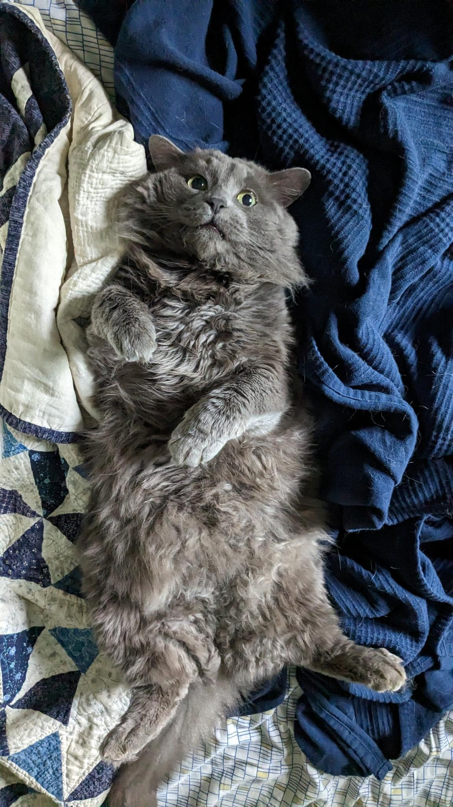
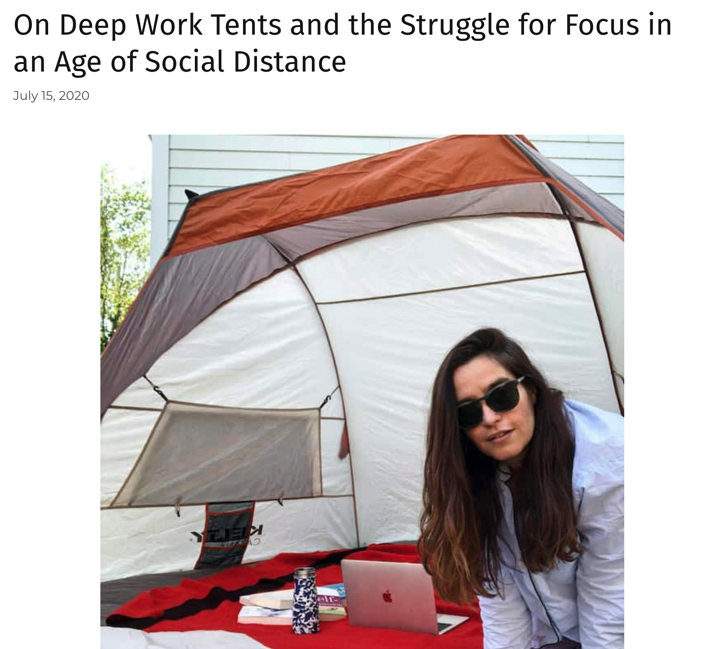
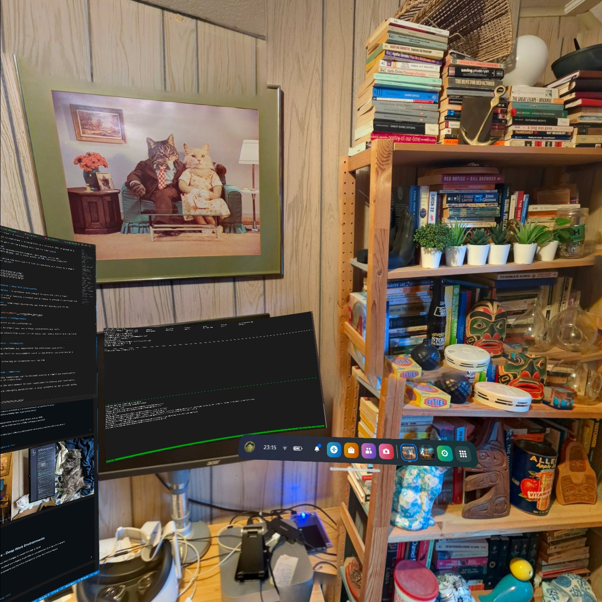
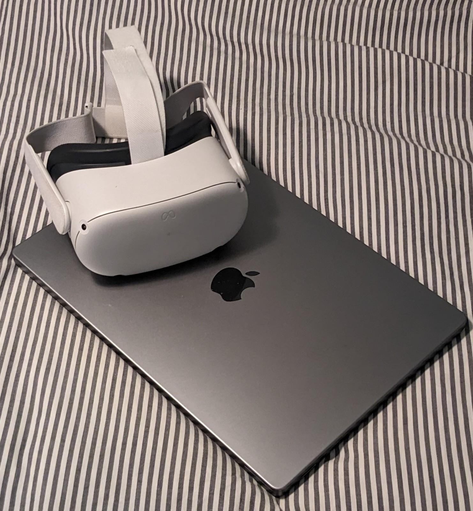

<!-- 
Notes: 
  * Hi everyone! 
  
  * Name is datalocaltmp or datalocal"temp".
  
  * Talking about Virtual Workspaces and how they've helped my Security Research.
  
  * Thanks to DCGVR for the space and all the hard work they've done gathering everyone!
  
  * Also after this presentation I'll be tweeting out a link to my slide-deck so if you're interested in any of the links here; you can grab them there.
-->

#
## Security Research in Virtual Workspaces

**@datalocaltmp**

---
<!-- footer: 'datalocaltmp | https://datalocaltmp.github.io/ | 2023' -->

<!-- 
Notes: 
  * Independent security researcher focused on mobile
  
  * Previously dedicated to researching privacy within mobile apps and featured in TechCrunch as "theappanalyst"
  
  * Some notable bounty programs I've worked with include Bird Scooters, Biden Campaign App, Ring Cameras, Match.com.
  
  * Nowadays I focus on mobile platform security and in particular reverse engineering the native layer
  
  * Virtual Reality Enthusiast
-->

# $whoami
## Security Researcher
* Previously focused on privacy issues within mobile applications.
  * Featured in TechCrunch for shining a light on apps screenshot'ing credit card information & passwords.

* Claimed bounties with: Bird Scooters, the Biden Campaign App, Ring Cameras, Match.com, etc.

* Nowadays focus on mobile platform security with a recent eye towards native reverse engineering.

* A virtual reality enthusiast!

---

<!-- 
Notes: 
  * In today's talk I'll be describing my experience in Virtual Workstations
    * You can see an example of that on the right there...
  
  * First I'll attempt to convince you that Security Research is something known as deep work
    * Apologies if this portion is filled with some corporate speak but I think it's worth saying
    * Trust me that we'll get away from this and into the virtual setup and technical portion.
  
  * Then I'll describe why I think virtual workspaces really lend themselves to Security Research
  
  * From there I'll get into my personal set-up and some pro-tips
  
  * I'll showcase a couple of technical examples of virtual workspaces
    * Debugging using LLDB and Voltron (very similar to GDB and GEF if you're familiar)
    * SRE with Ghidra and a visualization extension named Dragon Dance
      * This example particularly benefits given it's visual nature
  
  * Finally, I'll talk about what I see as the future of the space and things I'm excited about.
-->

# Content

* Security Research - Deep Work

* Virtual Workspaces - A Deep Work Environment

* Personal Setup:
  * Software & Hardware

* Example Tasks:
  * Debugging: LLDB & Voltron
  * Reverse Engineering: Ghidra & DragonDance

* Future VR Environments

---

<!-- 
Notes: 
  * We're going to kick off on describing Deep Work, and how it relates to Security Research.

  * It's a concept introduced by Cal Newport in his blog at the link there, and defines it as the "Cognitively demanding activities that leverage our training to generate rare and valuable results"

  * But, in another sense, it's the work we do that leverages our haxor skillz to find bugs.

  * This term, while sounding a bit like corporate jargon, will likely resonate with many of you; it really relates to the state I find myself in when I produced meaningful security research.

  * And so I imagine any work that you do to find CVE's or produce PoC's is likely deep work as well!
-->

# Security Research - Deep Work?

  * "Deep Work" coined by Cal Newport with a fantastic introduction in his blog [here](https://calnewport.com/knowledge-workers-are-bad-at-working-and-heres-what-to-do-about-it/)
  
    * "Cognitively demanding activities that leverage our training to generate rare and valuable results" - Cal Newport

    * "Work that leverages our skillz to find bugs" - datalocaltmp

  * The work that you do that produces a CVE or PoC is likely deep work.

---

<!-- 
Notes: 
  * Preparation is key as you're aiming to dedicate 1-3 hours of focused work time.

  * Ensure you have a clear goal in mind for this time on a topic that you think really benefits from deep work (perhaps not sending emails or updating socials).

  * Chunk that goal up and aim to tackle the first logical chunk, then try and stretch into starting the next in that session.

  * Track how long you are in this deep work state, it'll help you recognize the work you're doing and improve.

  * You only need to be in this state for a short period of time, for many that lends itself to using a virtual workspace.

-->

#
# Deep Work 101

* Preperation
  * Prepare your work environment to focus.

* Clarify
  * Set a dedicated goal for yourself.

* Stretch
  * Aim to tackle the next logical chunk work towards your goal;
  * attempt to push beyond that chunk.

* Track
  * Complete 1-3 hours of deep work, track your time, rinse and repeat.
  * The short nature of deep work does lend itself to VR.

---

<!-- 
Notes: 
  * Here is an example of what that would look like in practice for myself.

  * I'd clarify my goal to myself; perhaps understanding a vulnerability in a structure that is passed to a function

  * I'd define the chunks of work that I'd need to complete, perhaps starting with defining the members of the struct within a Ghidra Data Type.

  * I'd then prepare workstation and open all the software I'd need for that; perhaps GDB and Ghidra.

  * And then I'd try and stretch my deep work session into including working on investigating all access to a member of that struct.

  * And that's how it might look for me to get into my deep work state, however as I'm sure you'll resonate with;

-->

# Deep Work: An Example

  * Clarify
    * "I'd like to understand a vulnerability in a structure that is passed to a function"
    * Concrete chunk: Define a Ghidra Data Type for that struct
 
  * Preperation
    * Prepare my workstation/environment, open Ghidra, set-up GDB.
    * "I'll open Ghidra, set my break-points in GDB, and begin analyzing"

  * Stretch
    * "Once I define the data type I'd like to understand all access to a member within that struct."

---

<!-- 
Notes: 
  * Distractions kill deep work.

  * When a distraction appears and you have to context switch. this can kill your deep work state.

  * For example in a lot of my work, which could involve tracking variables across functions when reverse engineering, or comprehending complex security write-ups; I find that distractions similar to destroying the wall of yarn that ties ideas.

  * So in a distraction rich environment I find myself often caught in the shallow end attempt to work on a deep problem.

  * This involves doing things that don't really require any skill like updating scheduling future work or updating my socials. The feel productive because they do have value, but they're not enhanced by my skills.

  * I found it wasn't often that I immersed myself in the deep end of deep work.

  * And of course if I have an audience I have to include some photos of my distractions

-->

# Distractions kill Deep Work

  * Context switching destroys focus.
    * Tracking use of variables across decompiled functions.
    * Comprehending complex security write-ups.
    * Analogous to a wall of yarn that is destroyed every context switch.

  * Often caught in the shallow end while working on a deep problem.
    * "Oh I should plan a time for looking at that".
    * "Gotta spend time take producing content for my Twitter".
    * It's easy work and it feels productive...

  * It wasn't often that I immersed myself in the deep end, in deep work.

---

<!-- 
Notes: 
  
  * There's my workstation with my bizarre cat photo and 1980 wood paneled walls.

  * And there are two of my key distractors (there was no way I'd put a picture of my partner there...)

  * So how do I avoid distractions and embrace deep work?

-->

--- 

<!-- 
Notes: 
  
  * I embrace virtual workspaces that I believe are really suitable for deep work.

  * I think there are a lot of reasons to embrace these workstations because:

  * They're highly configurable; really providing a workspace that can change to match the task at hand.

  * They're extremely portable; only requiring a vr headset in addition to a laptop to provide a consistent and familiar environment.

  * They're Immersive; it's quite easy to completely disconnect yourself from the outside world

  * I'll quickly expand out each of those points;

-->

# Virtual Workspaces - Deep Work Environments

  * **Configurable** - A workspace that changes to match the task at hand

  * **Portable** - Only requires a headset and a laptop to provide a consistent and familiar environment
  
  * **Immersive** - Completely disconnects you from the distractions of the Non-Virtual World

--- 

<!-- 
Notes: 
  
  * For configuration; having a space that is dedicated to your deep work, isn't something new. This person here has even gone so far as to use a dedicated tent to disconnect themselves while they're in this working state. 
  
  * Here are some of the key points that I think will resonate with you all:

  * Virtual monitors are available to provide you with more working space than a single screen; they can be configured to be any size.

  * There are mature tools like Unity to create your own virtual environments and security research tools.

  * Though I don't think anyone has spent a serious amount of time in making interactive VR tools and if you do please @ me on twitter!

-->

# Virtual Workspaces - Configuration

  * Virtual monitors in any configuration

  * Mature tools like Unity to modify or create your own virtual environments and tools
  
  * A world of interactive VR security research tools that really hasn't been explored

--- 

<!-- 
Notes: 
  
  * When comparing a virtual workstation to something in your home; it's quite a bit more portable.

  * As I said you really only need a vr headset in addition to your laptop to gain the benefits.

  * Hand-tracking has gotten to the point where you don't really need any additional controllers. It comes with the added benefit of looking like Tom Cruise from minority report.

  * Also there is something to be said for providing a consistent and familiar environment as it's stored on the headset itself.

  * Although you'll still need some method of associating the headset with the computer, which can be either over the LAN or tethered
    * I personally pick tethered as it provides an extremely low-latency connection.

-->

# Virtual Workspaces - Portability

  * Hand-tracking precludes any requirement for additional controllers.

  * Consistent and familiar environments saved to the headset and provided at a moments notice.
  
  * Does require tethering or connecting over the LAN

--- 

<!-- 
Notes: 
  
  * And finally Immersion;

  * I can't stress enough how a pair of noise cancelling headphones and a vr headset can completely disconnect you from a distracting environment.

  * A pro-tip is to match the soundscape to your environment; it can really enhance your immersion when you're senses are inline with each other. (I should invest in some smellscape candles...)

  * Finally, if you do need to be reachable while deep working it's best to setup a messaging application on your computer. It can be fairly frightening if someone physically interacts with you while you're in this state of immersion!

  * Now I want to share some of my environments, specifically the environments I capture on my phone when I'm on vacation. I think it's a nice way of collecting space and capturing environments you find relaxing.

-->

# Virtual Workspaces - Immersion

  * Noise cancelling headphones and the headset provide a completely disconnected environment free of distraction.

  * Pro-tip: Match the environment to your soundscape to enhance your experience.
  
  * If you must, use messaging applications to stay connected to the outside world.

--- 

<!-- 
Notes: 
  
  * Here for example is the landscape of Corsica as my vr environment

-->

--- 

<!-- 
Notes: 
  
  * Here is me working in the streets of Korea

-->

--- 

<!-- 
Notes: 
  
  * And at it's temples

-->

--- 

<!-- 
Notes: 
  
  * And if you're really wild you can even work in your own home away from home.
  * cue bizarre cat photo again.
  * And so if you want to try out a virtual workspace here's what I have for my Personal set-up

-->

--- 

<!-- 
Notes: 
  
  * My personal setup is really everything you see in the photo there plus a set of noise cancelling headphones.

  * MacOS is nice as it supports Virtual monitors out of the box.

  * I have also ran Linux but it does require a lot of configuration to use virtual monitors.

  * If you're using Windows, it has an equivalent experience as MacOS.

  * For free software I use includes a Quest 2 App known as Immersed, which is a very fitting name, as well as adb (the Android debug bridge for those unfamiliar) which provides a lot of extra features as the Quest 2 is an Android device.

  * Specifically some of the features you get with adb are the tethering to reduce latency. For myself I get a shell in a modern Android environment, and you also get speedy file transfers between the headset and computer.

  * And now I use Frame VR for presenting!

  * Alright, I've now gone through Deep work, Virtual Workspaces, and how I set mine up; lets dive into some of these environments in practice.
  
-->

#
#
# Personal Setup

  * Quest 2 + Macbook + headphones
    * Ubuntu/Linux supported but lacking in certain features.
      * It does seem possible to use `xrandr` to fake out virtual monitors.
    * Windows has a similar support level as macOS.
  * Immersed + adb (Android Debug Bridge)
    * The Quest 2 is an Android device adb provides enhanced features
      * Tethering for reduced latency, a modern Android environment, speedy file transfers

---

<!-- 
Notes: 
  
  * I've compiled two examples to illustrate real situations I've found myself in that benefitted from my virtual workspace. In these examples I was traveling and only had my laptop and headset and so I'm really comparing working from only a laptop with my vr workspace.

  * As I said before the examples I'm going to work through are specifically debugging with LLDB and Voltron, as well as reverse engineering with Ghidra and the Ghidra extension Dragon Dance.

  * Both of these examples are documented on my blog and you're welcome to learn more about it there!

  * Finally, since the Quest 2 is a mobile device effectively, I'll be using Quest 2 native libraries as a target in both examples.

  * Specifically we'll be looking at the Meta developed libosutils and the benign getProcessName function that takes a pid and returns a string.

  * If you want to attempt this later on your own time there is some C code on my blog to compile a binary that calls this native libraries function.

  * So lets start with the Debugging example.
-->

# Virtual Workspaces in Practice

* A few examples to illustrate situations that benefit from virtual workspaces
  * Comparing laptop vs virtual workspace

* These examples are documented on my blog:
  * [LLDB + Voltron](https://datalocaltmp.github.io/debugging-android-with-lldb.html)
  * [Ghidra + Dragon Dance](https://datalocaltmp.github.io/visualizing-android-code-coverage-pt-1.html)

* Because I like mobile security and the Quest 2 is an Android device...
  * Let's debug some Quest 2 native libraries
  * `libosutils.so` -> `getProcessName(int pid)`
  * C code to build toy program [here](https://datalocaltmp.github.io/visualizing-android-code-coverage-pt-2.html)

---

<!-- 
Notes: 
  
  * So for those of you that are familiar with GDB. GEF is the GDB Enhanced Features extension. It's comparable to Voltron which enhances the features of LLDB.

  * FoundryZero has just create a true recreation of GEF for LLDB and it's appropriately named LLEF and I document using on my blog here if you want to learn more about that.

  * And the reason I've moved to LLDB is due to the Android NDK shifting support from GDB to LLDB; GDB support is being deprecated in the latest Android NDKS and I figured it was time to learn a new tool.

  * So now you know what and why of LLDB; lets quickly say when to use it; And that's when we experience a binary that is crashing and perhaps we have a stacktrace but we don't really know more than that.

  * The solution to this problem is generally attaching a debugger and stepping through it's execution.

  * And in generally that looks like this on a laptop.

-->

# Example: Debugging with LLDB + Voltron 

  * GEF is to GDB as Voltron is to LLDB
    * FoundryZero has just created LLEF and my comparison is documented [here](https://datalocaltmp.github.io/debugging-android-with-leff.html)

  * Recently moved to LLDB from GDB due to Android NDK support shift
    * This is documented in the "[Using Debuggers](https://source.android.com/docs/core/tests/debug/gdb)" Android documentation

  * Problem: We have a binary but don't know why it's crashing.
    * Solution: Attach LLDB and start your analysis

---

<!-- 
Notes: 
  * So on our single screen we have a ton of condensed information
    * At the top is the LLDB interpreter
    * Below that is the Stack
    * Below that is the Registers and the Disassembly
    * Finally we have the back trace

  * It's fairly obvious, but the terminal at this point is at it's max for conveying information; it would be hard to visualize more information without additional windows that you'd have to switch between.

  * And this is only showing what it's like to visualize the information let alone taking notes on what you're finding.

  * So what does this look like in a virtual workspace...
-->

---

<!-- 
Notes: 
  * In a virtual workspace we get to configure virtual monitors any way we'd like.

  * This comes at the cost of course of using a vr headset, but the value it provides I believe is worth it.

  * On the far right monitor we have:
    * the stack visible on top, followed by two hexdumps of interesting memory locations
    
  * On the middle monitor we have:
    * the same LLDB interpreter
    * the registers and disassembled binary

  * And finally on the far left monitor we have our notes capturing any findings

  * Personally, I find that this experience really prevents having to change windows which can sometimes be equivalent to context switching itself.

  * So this was an example of debugging; lets look at Reverse Engineering.
-->

---

<!-- 
Notes: 

  * So I must admit my intuition on why things crash could be better and I previously would often find myself setting a lot of haphazard breakpoints trying to understand a binaries execution.

  * Often this meant I would open my decompiler of choice, which is Ghidra, and begin reversing in order to guide my breakpoint placement. I'm here to tell you there is a better way.

  * And that better way is to use Frida and Lighthouse to generate code coverage maps and then use those to visualize execution.

  * This will help guide you on what portions of code are actually executed and can help focus your reverse engineering.

-->

# Example: SRE with Ghidra + DragonDance

  * Have a LLDB session but don't know where to place break points or how to approach the analysis.

  * Open your decompiler of choice and begin SRE, or ...

  * Using Frida with Lighthouse we can generate code coverage maps (the executed code within the binary)
  
  * Load these coverage maps into the DragonDance Ghidra extension to visualize execution.

---

<!-- 
Notes: 

  * So on a laptop that sort of looks like this; and to say it's disappointing is an understatement.

  * We have the function graph on the righthand side that is highlighting the basic blocks of code that execute. In the middle we have our listing pane that shows the disassembled binary and highlights the arm instructions that ran.

  * Note that we're not getting, specifically:
    * We can hardly see the decompiled output
    * We can't to see our symbol table
    * And we also can't see our Ghidra Data Types.

  * Now what does this look like in a virtual workspace.

-->

---

<!-- 
Notes: 

  * Aside from being at a fantastic Korean palace, we get a lot more information while conducting reverse engineering.

  * We are able to see the entire function graph, rather than a small snippet.

  * We have a large decompiled view with our symbol table and data types.

  * and last but certainly not least we have our note taking app of choice available to document any findings.

  * So this is what's possible today using free software; lets take a quick moment to talk about what I'm excited about for future workspaces.

-->

---

<!-- 
Notes: 

  * So of course there are new headsets with better resolution, eye tracking, and hand tracking; I'm more interested in the software side of things.

  * As I said before, Unity provides an environment for building your own workspaces and tools from scratch.

    * I'm excited to see what developers create in the future to support

  * Right now a lot of what I've shown is really about visualizing information on more monitors; but I think there is a lot of space for custom VR tools for security research.

  * Though I don't want to pretend that there isn't a large learning curve for Unity if you are interested in taking a stab at developing tools.

  * I personally took a stab at developing my own work environment in Unity and ....

-->

# Future Virtual Workspaces

* Unity gives you the tools to build your own workspaces!

* Custom built to suit your needs and doesn't need to just be more monitors

* Large learning curve and I must admit I haven't gotten to this point.

---

<!-- 
Notes: 

  * That experience looked something like this with a lot of importing of other free assets and learning VR development.

  * And that development resulted in something like this...

-->

---

<!-- 
Notes: 

  * A virtual workstation that has all the information I need at hand;

  * The ability to browse and a familiar strange cat photo hung above my desk.

  * And with that...

-->

---

<!-- 
Notes: 

  * I'll leave you with my parting thoughts.

  * I found VR workspaces to be a nice escape when work-from-home became the norm; it was a nice way of getting outside while being inside.

  * And of course this definitely isn't for everyone; it does take a while to get used and I would recommend first trying some games in VR to hone your "legs" and know how long you can be in the space before your eyes feel fatigued.

  * Also the virtual monitors can become computationally intensive so keep that in mind (you can really only have as many virtual monitors as your computer can handle)
  
  * And remember that your time in VR performing deep work doesn't need to be long; it just needs to be meaningful.

-->

# Parting Thoughts

* When work-from-home became the standard, it was nice to be able to work outside inside.

* This isn't for everyone of course
  * Eye-fatigue, "VR legs", virtual monitors become computationally intensive
  * You're just the folks that are already in VR so...

* Remember that it doesn't need to be long, it just needs to be meaningful.

---

# Questions?

---

# Thanks!

